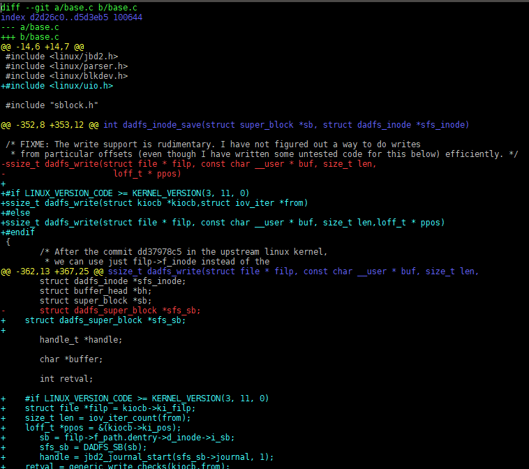
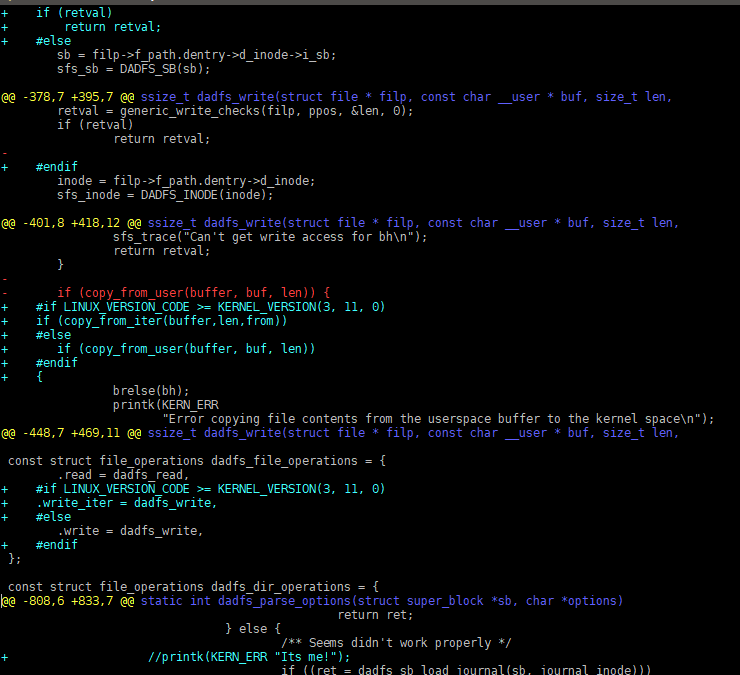
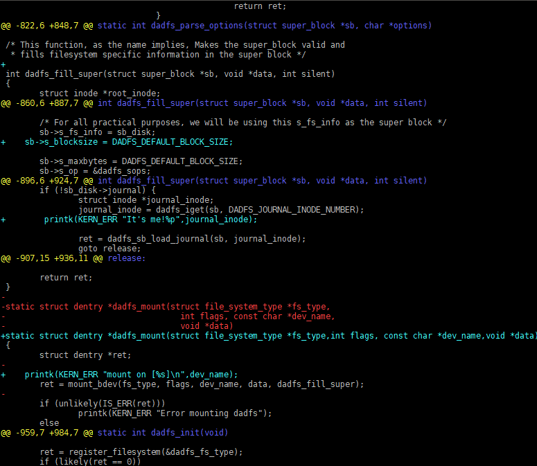
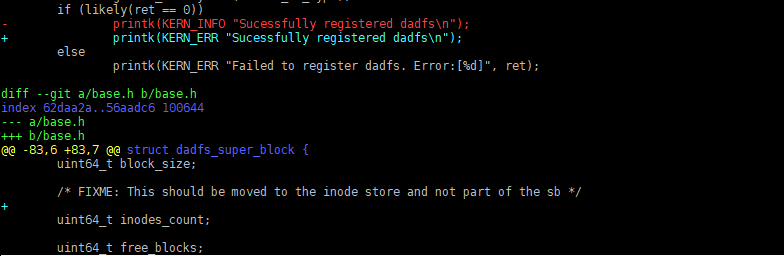

#  VE482 Linux Challenge  

## Changes  

The changes are basically updating the functions which needs new arguments such as kiocb and iov_iter. What lists below are the patch file for difference

 

 

 

 
