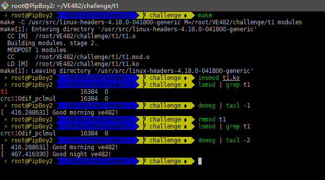

  

#  VE482 Linux Challenge     

## Platform  
In this challenge, all codes are compiled/tested in my Aliyun ECS server. The basic information is given below:
+ OS: Ubuntu 18.04 bionic
+ Kernel: x86_64 Linux 4.18.0-041800-generic  
## Introduction
This is the directory for Zhang Yichi's working on the Linux challenge for VE482 course. To access my work on a certain task, get into the corresponding task directory and you will see the source code. Also, for further explanations and test results, please refer to this README file.

## Task Manifest
### Task 1
The task asks to write a kernel module and use Makefile to compile it. The source code and Makefile are in the directory t1. In the Makefile, I use $(shell uname -r) to detect the version of the kernel.

To see the effect of unload the module, I also let it output "Good night ve482!" when exiting. The image below shows the result of compilation and testing.

  

### Task 2  
I have already cloned the latest git tree of linux kernel by Linus Trovald. 

I use the directory /root/build/kernel to store the build result. The first step of compiling is set the confuguration of the version name. Use the command   

> make O=/root/build/kernel menuconfig

In the apeearing interface, tick the highlighten option to enable LOCALVERSION_AUTO.  

Then do the following

> make O=/root/build/kernel localmodconfig
> make O=/root/build/kernel  
> make O=/root/build/kernel modules_install   
> make O=/root/build/kernel install  

Then the kernel image and system map will appear in the directory /boot/. Reboot the system and the kernel appears to be the new one.

### Task 3
This is done by modifying the EXTRAVERSION field in Makefile. After rebuilding and reboot, the version string shows 

 

The postfixes are due to my enabling of LOCALVERSION_AUTO, and "dirty" means the kernel is modified compared with the original version.

Next is do the patch. use the following commands  

> git add Makefile  
> git commit -s -v  
> git format-patch master  

The description of the patch is shown below  

   

Then use the patch checking tool for to check 

 

### Task 4  

I modified the code (The modified codes are in directory t4) and it shows that both the source code and the Makefile pass the check.

 

### Task 5

Because I cannot plug USB into ECS, the base I used is the dual OS on my computer, which is of Archlinux with Linux kernel 4.19.2

The main point is to write a interface driver for usb keyboard devices. The result is shown below

 

The first line shows that the new driver is registered, and following lines happened when I plugged my USB keyboard. It seems that the new module works. The codes are in directory t5

## Contact 
**Zhang Yichi**  

+ Email: [charleschang213@sjtu.edu.cn](mailto:charleschang213@sjtu.edu.cn)
+ Student ID: 516370910260